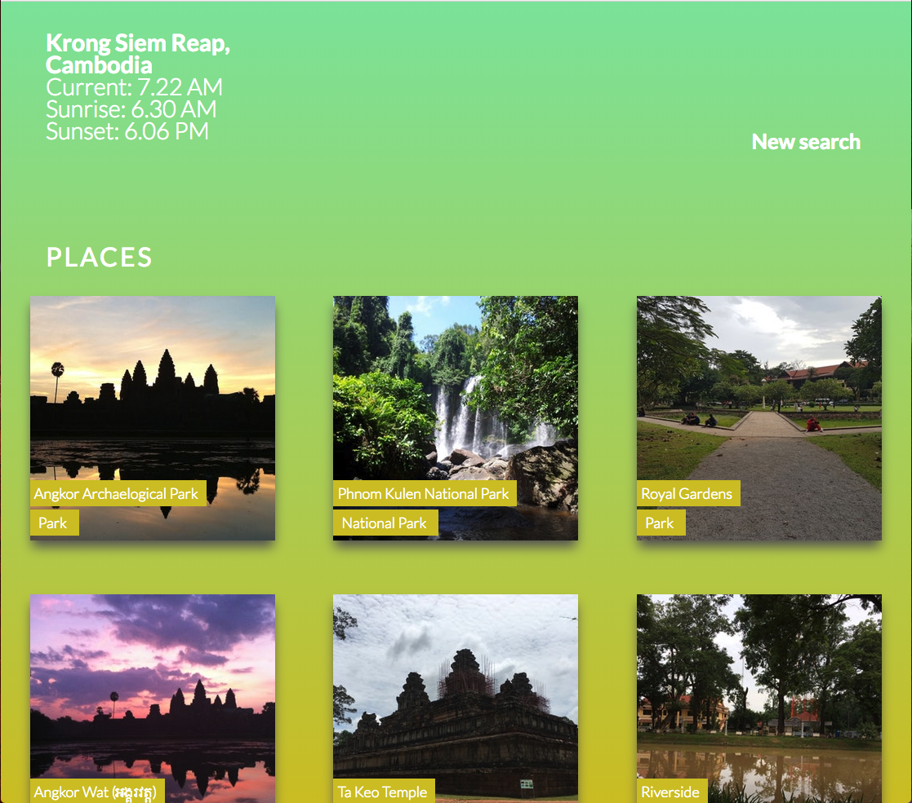
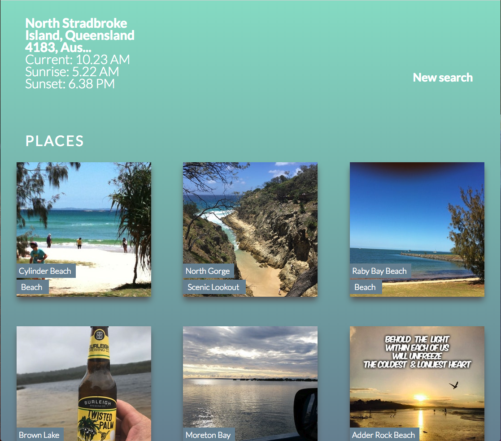

# Sunset and Sunrise times app

An app that uses different APIs to fetch location data (longitude and latitude) from user's search query, then uses this to get current sunrise and sunset times for location, as well as places in the vicinity of mentioned location to watch the sunset - like parks and beaches.

The background gradient is dynamic and is calculated based on the current time of day at location and how close to sunrise/sunset/night etc. it is at that particular location. This means you would get a different background gradient for a search done at 6pm in Norway during the winter and the summer for instance.

## APIs

* [Sunrise Sunset API](http://sunrise-sunset.org/api)
* [Foursquare API](https://developer.foursquare.com/)
* [Google maps API](https://developers.google.com/maps/)
* [Google time zone API](https://developers.google.com/maps/documentation/timezone/intro)
* [Google geocoding API](https://developers.google.com/maps/documentation/geocoding/start)

## Screenshots

